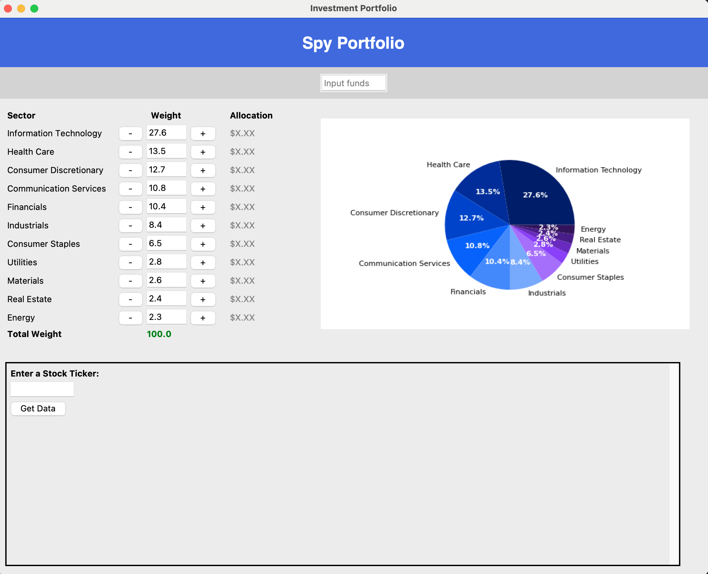
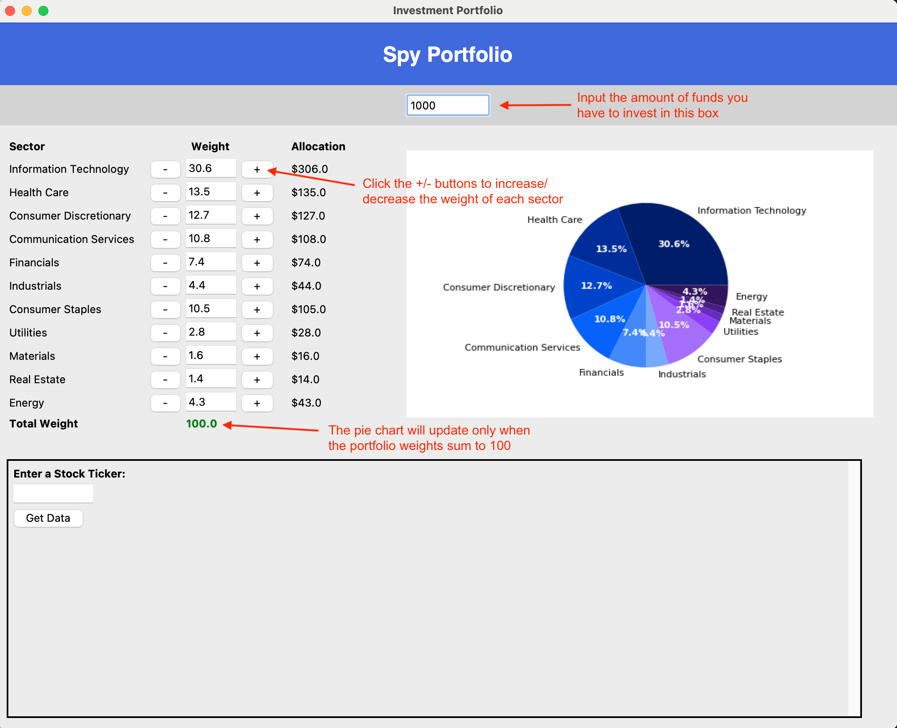
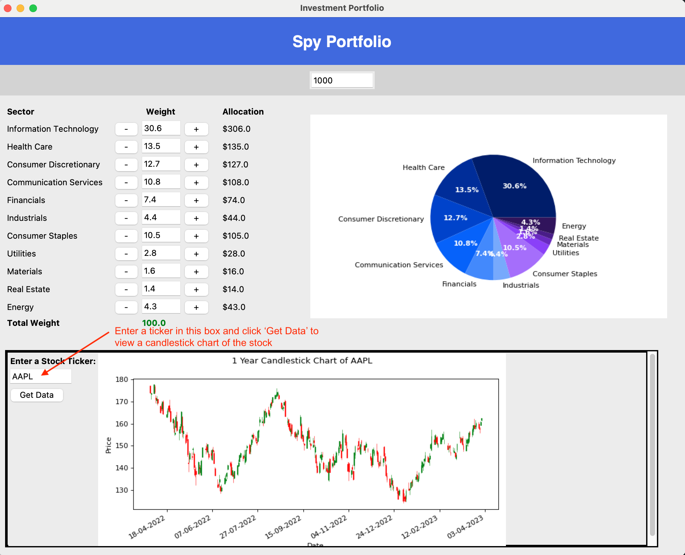

# Investment Portfolio Visualizer
This is a software tool that helps you construct an investment portfolio based on the S&P500. The idea behind this portfolio strategy is that the S&P500 is historically the best performing index over the long run. While it might give lower returns in the short run when compared to another index fund representing new technologies or fads, like crypto or virtual reality, it still remains undefeated in long run performance. This is where my strategy comes into play: you should begin by matching the sector weights of the S&P500, then give more weight to the sectors you believe will outperform the market and remove weight from the sectors you believe will stagnate or underperform. This allows you to have the potential for higher short run gains while still being able to match the long run performance of the S&P500 index.

The primary libraries I use in this project are Tkinter to create the GUI and its interactive features, Matplotlib to create the graphs, and Pandas.

_Instructions on how to run the tool on your computer are included at the bottom of this writeup._

Below are some screenshots of the tool.

This is what you will see when you first run `main.py`.

You can input the amount of funds you have to invest in the box at the top, then it will automatically calculate how much money to put in each sector. You can then adjust the weight of each sector by clicking the +/- buttons, and the pie chart will update when the sector weights sum to 100.

Lastly, you can input any ticker symbol in the box shown below and it will display a 1 year candlestick chart for that stock. This black square area is where I plan to update the tool to display additional data on stocks of your choice.

---
**How to run the tool on your own computer**

1. Install the following libraries: Tkinter, Matplotlib, Pandas
2. Run `main.py` and a window should pop up with the interface
3. A text file with the sector weights will appear in the same directory as the rest of the files. This file is what allows the pie chart to update when you click the +/- buttons on the left to adjust the weights of each sector. 
